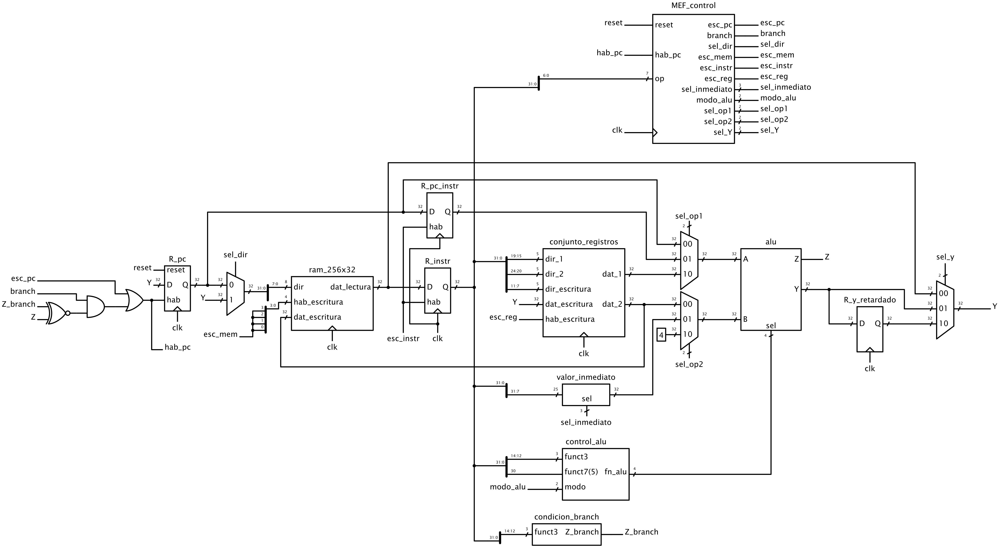

# Proyecto 10 - Nucleo Risc-V, primera versión

Electrónica II para Ingeniería Electrónica. 2024

## Objetivos

- Definir Arquitectura de Computadora
- Explicar brevemente de que se trata la arquitectura RISC-V y el conjunto de instrucciones RV32I
- Describir el conjunto de registros de la arquitectura RISC-V
- Estudiar, del conjunto de instrucciones RV32I
  - Describir la estructura de las instrucciones tipo R, I, S, B, U y J.
  - Determinar como se calcula el valor inmediato para los tipos I, S, B, U y J.
  - Analizar las instrucciones de código de operación decimal 19 y 51, encontrar la manera en que se codifica la operación matemática de la ALU
  - Analizar las instrucciones de código de operación decimal 99 (saltos condicionales), determinar la forma en que se codifica la operación de la ALU y la condición de cero necesaria para tomar el salto.
- Definir Microarquitectura de computadora
- Con asistencia del material presentado en clase y las referencias bibliográficas, diseñar un datapath multiciclo que permita implementar el conjunto de instrucciones RV32I. Considerar los bloques desarrollados en proyectos anteriores: registro de 32 bit, memoria RAM 256x32 bit, conjunto de registros 32x32 bit de tres puertos y unidad aritmética lógica de 32 bit. Adaptar los bloques según sea necesario.
- Determinar las operaciones necesarias para la implementación en el datapath diseñado de las operaciones RV32I `lw`, `sw` y las de codigos de operación 19, 51, 99, 103 y 111.
- Diseñar una unidad de control (máquina de estado finito) capaz de ejecutar las instrucciones mencionadas en el apartado anterior.
- Realizar la descripción de hardware en VHDL de un procesador conformado por el datapath y control diseñados. La Figura 1 muestra un diagrama esquemático ilustrativo del diseño final esperado.
- Evaluar mediante simulación el desempeño del procesador desarrollado utilizando el programa de prueba del Listado 1 (dado en ensamblador y código máquina).

Listado 1: Listado del programa de prueba.

~~~ asm
dir(hex): código máquina (hex)   código ensamblador
   0:   02400293                addi    t0,zero,36
   4:   00000313                addi    t1,zero,0
   8:   00800393                addi    t2,zero,8
   c:   0100006f                jal     zero,1c
  10:   0062a023                sw      t1,0(t0)
  14:   00428293                addi    t0,t0,4
  18:   00130313                addi    t1,t1,1
  1c:   fe734ae3                blt     t1,t2,10
  20:   0000006f                jal     zero,20
~~~

Figura 1: Diagrama esquemático del diseño final esperado

## Entregables

Las descripciones de hardware y bancos de prueba realizados. Usar este repositorio como base y añadirlos dento del subdirectorio `src`. Copiar y utilizar los archivos de diseño relevantes (no los bancos de prueba) de los proyectos 8 y 9. Utilizar `make nuevo_...` para crear plantillas iniciales para los diseños nuevos y sus bancos de prueba según sea necesario.

Un informe con la siguiente estructura:

- *Título*
- *Autor*
- *Resumen* (1 punto)
- *Introducción* (2 punto) Presentar los conceptos de arquitectura de computadora y microarquitectura.
- *Desarrollo* (2 puntos) Presentar los resultados de la investigación sobre la arquitectura RISC V y el conjunto de instrucciones RV32I.
- *Resultados* (2 puntos) Presentar el diseño del procesador. Indicar los componentes desarrollados y sus bancos de prueba. Presenta un análisis de los resultados de simulación. Determina si el programa de ejemplo fue ejecutado correctamente.
- *Conclusiones* (2 puntos) Explica con tus palabras los conceptos aprendidos y valora las capacidades del diseño obtenido.
- *Referencias* (1 punto) Debes utilizar citas bibliográficas durante el desarrollo siempre que emplees ideas tomadas de la bibliografía. Esta sección incluye las referencias bibliográficas correspondientes, en formato APA.
